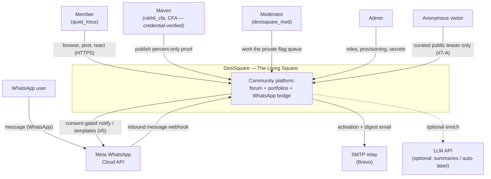
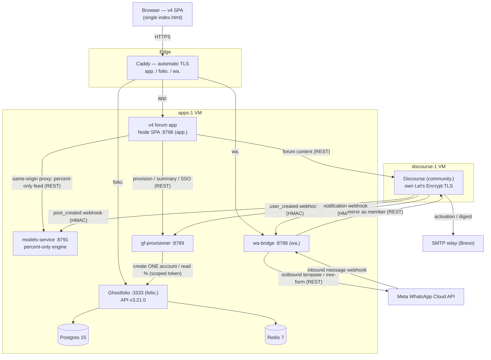
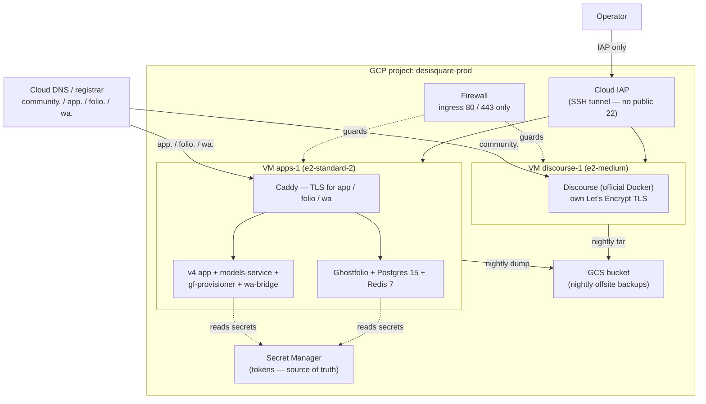
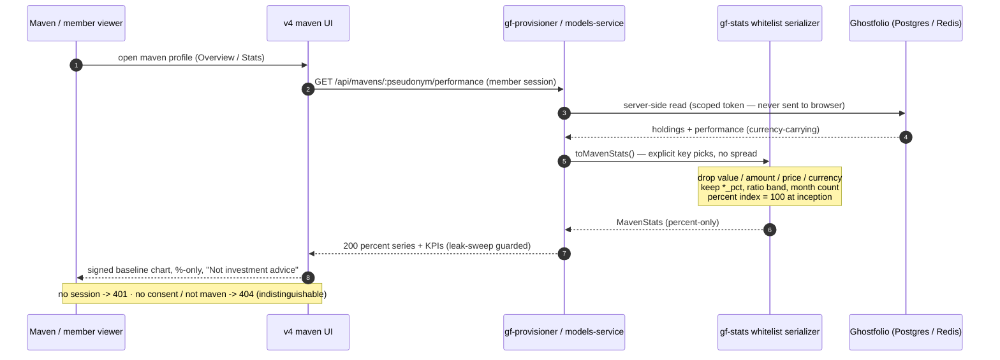
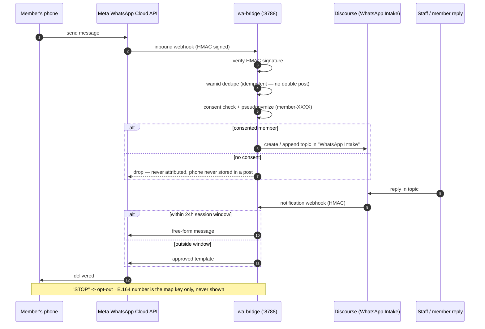
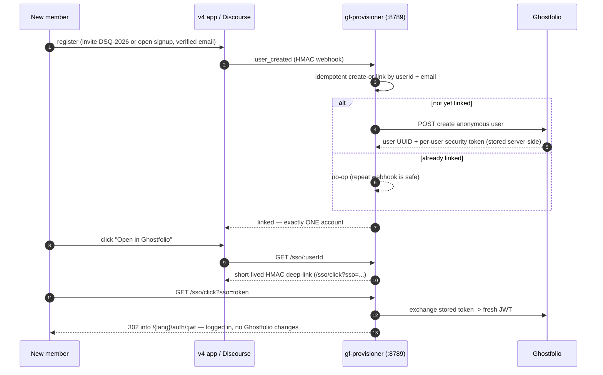
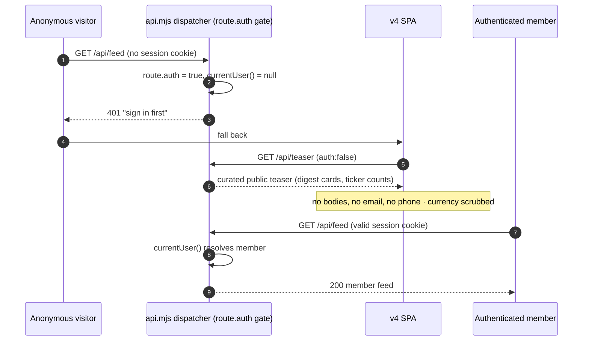

# DesiSquare V3 — Architecture

**"The Living Square": a Discourse + Ghostfolio + WhatsApp community for desi retail investors.**

This document is the architectural map of DesiSquare V3 — the final integration of the v1/v2 codebases.
The diagrams are the centrepiece; the prose supports them. Every diagram is a valid Mermaid block and
renders on GitHub and inside Claude artifacts.

The whole system is designed around **six non-negotiable product constraints**. They are not bolted on —
each one is enforced by a specific component or layer, mapped in section 8. Keep them in mind while reading:

- **#3** — flags are private (reason → mod review queue); no public flag indicator, ever.
- **#4** — portfolio dollars are owner-only; public surfaces show allocation **%** only, default private.
- **#5** — WhatsApp mirroring/notifications are consent-gated; E.164 phone numbers never appear anywhere.
- **#7-A** — anonymous visitors get only the curated public teaser; every member endpoint 401/403s.
- **#8** — maven performance is percent-only; currency is stripped server-side.
- **#9** — recognition ranks engagement (karma), never money or % returns.

---

## 1. C4 System Context

The people and external systems around the DesiSquare boundary. Members, mavens, moderators, admins and
WhatsApp users interact with the system; anonymous visitors see only the curated teaser. Three external
services sit outside the boundary: Meta's WhatsApp Cloud API, an SMTP relay (Brevo), and an optional LLM API.

**Legend.** Solid edges are always-on flows; the dotted edge to the LLM API is optional. The WhatsApp user
reaches the system only through Meta's Cloud API — never directly. Anonymous visitors cross the boundary but
are held at the teaser (section 7).

---

## 2. Container diagram

Inside the boundary, the runnable containers and the protocols between them. The browser loads a single-file
SPA (v4 app). Caddy terminates TLS for the three app subdomains and reverse-proxies to the v4 app, Ghostfolio,
and wa-bridge. The v4 app is the same-origin front door: it proxies to the percent-only engine and the
provisioner, and reads forum content from Discourse. models-service and gf-provisioner have **no public DNS** —
they are reached internally.

**Legend.** Cylinders are datastores. Every Discourse → service edge is a signed webhook (`sha256=` HMAC).
Ghostfolio's scoped read token lives only server-side in gf-provisioner/models-service — it never reaches a
browser. The v4 app degrades to seeded content when any upstream is unreachable (section 9).

---

## 3. Deployment diagram

The production GCP topology: two VMs, four DNS subdomains, Caddy TLS on apps-1, Discourse's own TLS on
discourse-1, Secret Manager as the token source of truth, a GCS bucket for nightly offsite backups, and
SSH restricted to Cloud IAP. The firewall admits only ports 80/443.

**Legend.** Dotted edges are guard/enforcement relationships (firewall, secret reads). `.env` files stay on
the VMs at mode 600; Secret Manager holds the canonical copy of Meta/Discourse tokens. Demo mode collapses
this onto sslip.io hostnames with no registrar, but the shape is identical.

---

## 4. Sequence — maven percent-proof (#8)

How a maven's verified performance reaches the UI **without currency ever crossing the boundary**. Ghostfolio
holds currency-carrying values; gf-provisioner/models-service reads them server-side; the gf-stats whitelist
serializer strips everything that is not a percent, ratio band, or month count; the v4 maven UI renders a
signed percent index (100 at inception). The leak-sweep test is the machine backstop on that serializer.

**Notes.** The v4 app additionally refuses any live feed that is not *demonstrably* currency-free (a regex
guard rejects `$ ₹ £` + digits and any `value` key), falling back to the seeded, guaranteed-safe computation.
Payload is cached ~24h and served stale up to 48h; beyond that the client renders an honest "temporarily
unverified" state. Nothing here may be sorted or ranked (that would violate #9).

---

## 5. Sequence — WhatsApp intake loop (#5)

The consent-gated round trip between a member's phone and Discourse. Inbound messages arrive as a Meta webhook;
wa-bridge verifies the HMAC signature, dedupes on `wamid`, checks consent, and pseudonymizes the sender to
`member-XXXX` before creating a topic in the **WhatsApp Intake** category. Staff replies flow back out, choosing
a free-form message inside the 24-hour session window or an approved template outside it.

**Notes.** The phone number is only ever a lookup key; logs use a salted hash and no endpoint echoes it back.
An unmapped or opted-out sender is demoted to guest attribution with an invite — defense-in-depth is duplicated
in the v4 app's `createMirroredPost`, so the two consent stores diverging can never mis-attribute a post.

---

## 6. Sequence — signup → provision → SSO (#4-adjacent)

Registration provisions exactly **one** Ghostfolio account, idempotently, and offers a one-click SSO deep-link.
gf-provisioner links by `userId` and `email`, so a repeated webhook never double-creates. Ghostfolio has no
URL-param SSO, so the "Open in Ghostfolio" link points back at our own click endpoint, which exchanges a stored
per-user token for a fresh JWT and 302-redirects into Ghostfolio's own auth callback.

**Notes.** The security token never leaves the server; the browser only ever sees short-lived, HMAC-signed
links. Bad/expired tokens render a small branded 410/401 notice. Verified end-to-end against Ghostfolio v3.21.0.

---

## 7. Sequence — the #7-A teaser gate

Every member endpoint is closed to anonymous callers at the dispatcher. An anonymous request to `/api/feed`
is rejected `401` before any handler runs; the SPA falls back to the one open content path, `/api/teaser`.
An authenticated member's identical request resolves a session and succeeds.

**Notes.** Only `/api/teaser`, `/api/health`, session/register, and the anonymous slice of `/api/bootstrap`
carry `auth:false`. Chat, presence, search, events, profiles, maven performance and the demo driver all 401/403
anonymously. The teaser exposes pseudonyms and counts only — never a full author card, email, phone, or a
currency figure.

---

## 8. Trust boundaries & constraint-enforcement map

Each non-negotiable constraint is enforced at a specific, testable layer. The leak-sweep CI (story 12.5) is
the machine backstop that keeps these honest.

| # | Constraint | Enforced at | How |
|---|---|---|---|
| **#3** | Flags private | `api.mjs` flag route → `reviewQueue` | Negative reactions land in the mod queue only; `postVM` exposes no flag field; no public flag indicator is ever rendered. |
| **#4** | Dollars owner-only; public %-only, default private | `api.mjs` `/api/users/:id` + `scrubCurrency` | Owner (`isSelf`) sees `value`/`ytd`; others see `holdings` allocation **%** only when `portfolioPublic`, else `view:"private"`. Teaser scrubs `$ ₹ £`. `#/me` is the single dollar surface. |
| **#5** | WhatsApp consent-gated; E.164 never shown | `wa-bridge` consent + optout store; `stripPhoneNumbers` | Phone is the map key only; never returned or written into a post; logs use a salted hash. `createMirroredPost` re-checks consent (defense-in-depth). |
| **#7-A** | Anonymous → teaser only; member endpoints 401/403 | `api.mjs` dispatcher `route.auth / mod / admin` gate | `currentUser()` null → `401`; wrong group → `403`. Only teaser/health/session/bootstrap-base are `auth:false`. |
| **#8** | Maven performance percent-only; currency stripped server-side | `models-service` percent index + `gf-stats` `toMavenStats()` + `leak-sweep.test.mjs` | Equity series is a percent index (100 at inception); serializer allowlists keys (`*_pct`, `months`) and forbids currency vocabulary/patterns; v4 regex-guards any live feed before trusting it. |
| **#9** | Recognition ranks engagement, never money | `api.mjs` `karmaFor` + `/api/leaderboard` | Karma counts only reactions **received** (`KARMA_WEIGHTS`); portfolio value and % returns can never enter the karma path; leaderboard sorts karma, not money. |

**Trust boundaries.** (a) Browser ↔ server — no secret or currency figure crosses to a public/maven surface.
(b) Services ↔ Ghostfolio — the scoped token stays server-side. (c) wa-bridge ↔ Meta — HMAC-verified, consent
is the gate. (d) Anonymous ↔ member — the dispatcher auth gate.

---

## 9. Technology & data-flow notes

- **Zero-dependency Node stdlib.** Every service (v4 app, models-service, gf-provisioner, wa-bridge) runs on
  `node:http` + `node:test` with no `npm install`. Heavy live backends (real Ghostfolio client, `whatsapp-web.js`
  Chromium bridge) sit behind seams and are dynamic-imported only when enabled — the default stays dependency-free
  and offline-runnable.
- **Degrade-to-seeded fallback.** The v4 app serves seeded content when any upstream is down, so the demo runs
  standalone. Maven performance falls back to the built-in `buildPerformance` computation whenever gf-provisioner
  is unreachable *or* a live feed is not demonstrably currency-free.
- **Percent index invariant.** The performance equity series is a **percent index = 100 at inception**. Currency
  never enters models-service or gf-stats, so #4/#8 hold at the engine level rather than by UI discipline alone.
- **Where state lives.**
  - v4 forum app → single JSON file store (`db.json`); schema maps 1:1 to Postgres when promoted.
  - models-service → `data/state.json` (immutable entry ledger + price bars); deterministic fixture prices.
  - Ghostfolio → **Postgres 15 + Redis 7** (portfolio truth, currency-carrying — never re-exposed as-is).
  - Discourse → its own Postgres inside its Docker install (forum content, users, categories).
  - gf-provisioner / wa-bridge → per-process file stores in the stub; production moves them to Postgres tables
    (`identity_link`, `phone_map`, `wa_message_log`) + Redis for hot dedupe/lookups.
- **Idempotency & signing everywhere.** Discourse → service calls are `sha256=` HMAC webhooks; provisioning is
  idempotent on `userId`/`email`; WhatsApp intake dedupes on `wamid`; models-service dedupes signals on `postId`.

---

## 10. Scaling path (F6, brief)

The two-VM topology is deliberately promotable without rework. When the pilot outgrows it:

- **Stateless services → Cloud Run.** The v4 app, models-service and gf-provisioner are stateless request/response
  services — containerize and autoscale (scale-to-zero for cost). Put a **CDN** in front for the static SPA and the
  public teaser.
- **wa-bridge stays stateful.** The live `whatsapp-web.js` session is a single paired device, so it runs as one
  **StatefulSet + PVC on GKE Autopilot**, not a scaled Cloud Run service. Outbound remains on the compliant Cloud API.
- **Managed data tiers.** Ghostfolio's Postgres → **Cloud SQL**; Redis → **Memorystore**; Discourse's Postgres →
  Cloud SQL (or keep its self-managed Docker DB and back it up to GCS as today).
- **One orchestration plane.** For multi-instance operation across all components, consolidate onto **GKE Autopilot**
  with Caddy/Ingress terminating TLS, Secret Manager wired via Workload Identity, and the existing nightly GCS
  backups retained.

---

*Positioning is educational only — never investment advice. Disclaimers stay on every content surface (story 11.1).*
