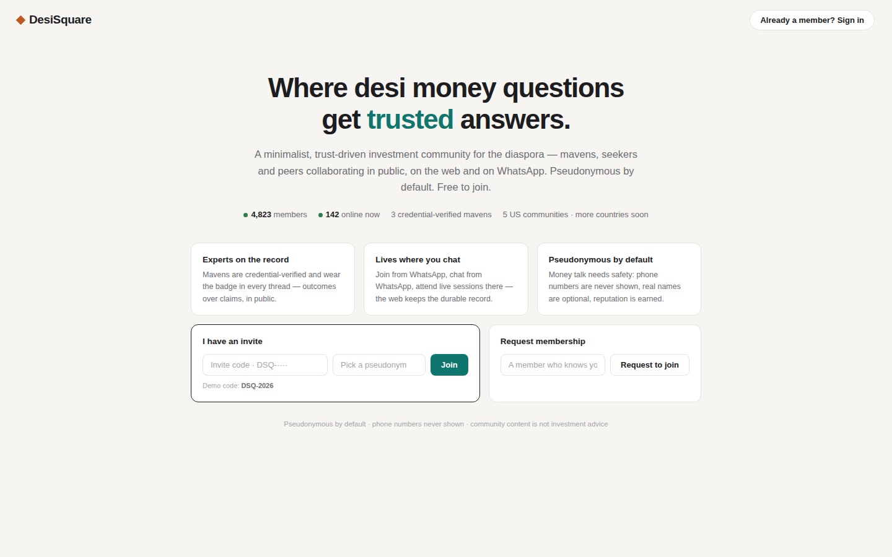
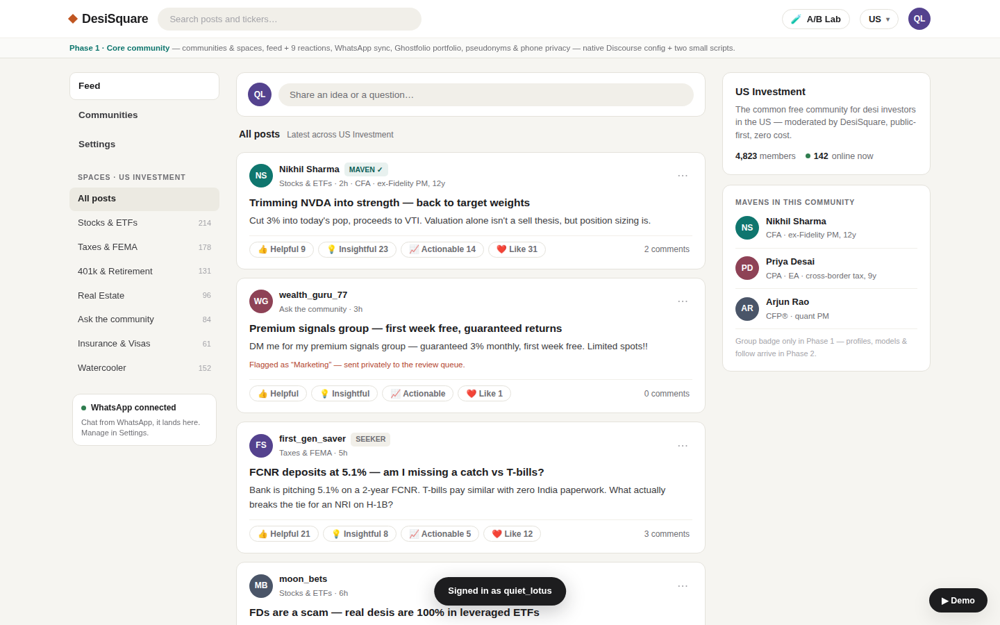
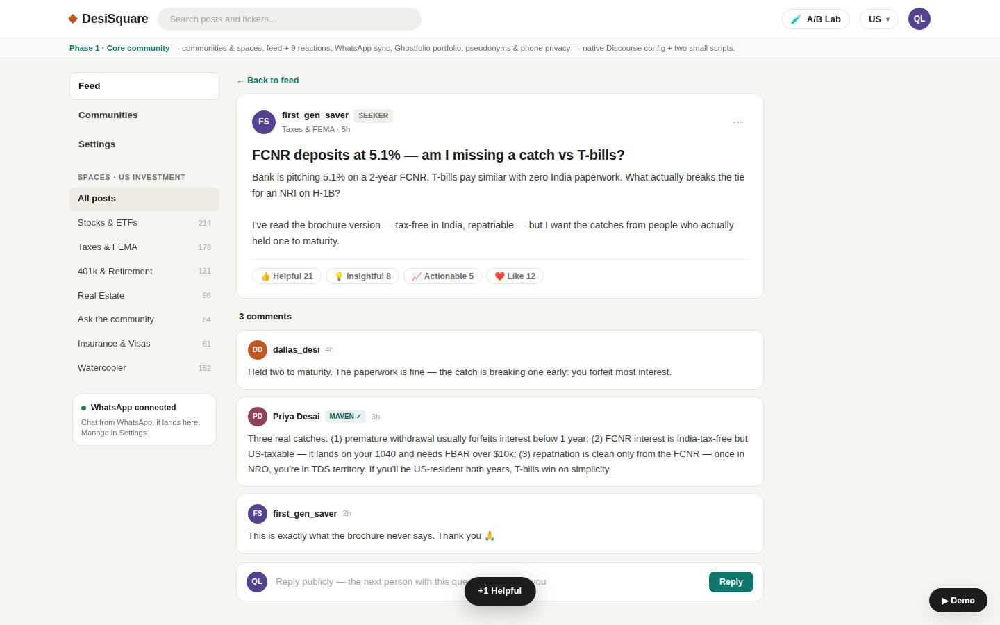
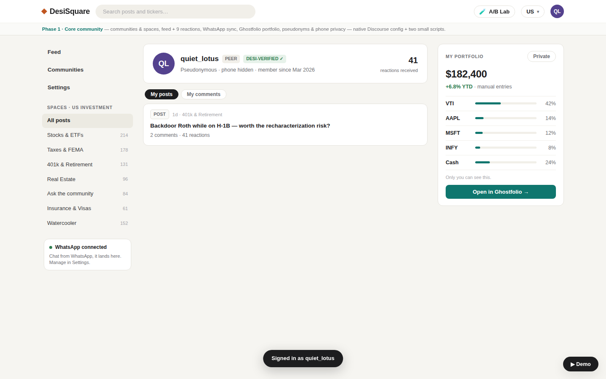
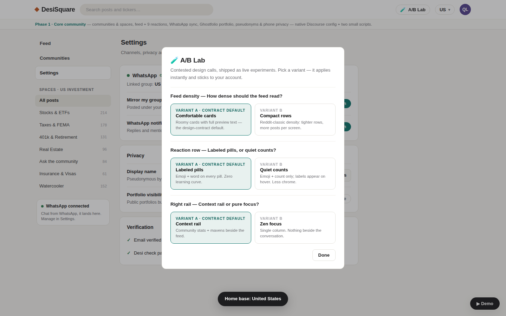
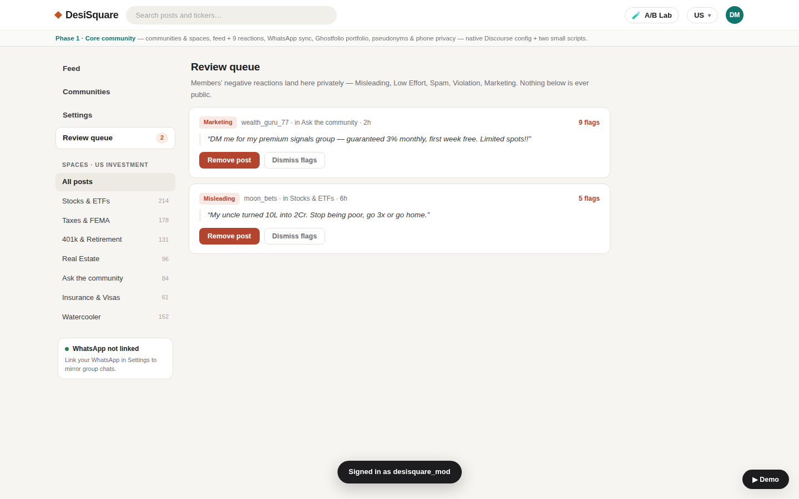

# DesiSquare Phase-1 MVP — the cut-down, runnable prototype

A complete, runnable implementation of **Phase 1** from the design handoff
(`docs/design-handoff-phase1/`): a minimal, Reddit-calibre community for desi-diaspora
investors — pseudonymous by default, public-first, living on the web **and** on WhatsApp,
with a one-click Ghostfolio portfolio per member.

**Run it:** `make demo` from the repo root, then open http://localhost:8786.
Full instructions, tracks and troubleshooting: [RUNBOOK.md](./RUNBOOK.md).

| | |
|---|---|
|  |  |
| The public landing — all a signed-out visitor sees | The feed: composer, 4 public reactions, maven rail |
|  |  |
| Threaded answers with maven badges | Reddit-style profile + private-by-default portfolio |
|  |  |
| The A/B Lab — pick live design variants | Moderator review queue — negatives land here privately |

More: [compact/zen feed](docs/screens/14-feed-compact-zen.png) ·
[demo driver](docs/screens/15-demo-drawer.png) ·
[mobile](docs/screens/18-mobile-feed.png) ·
[allocation-only public portfolio](docs/screens/19-public-profile-allocation-only.png) ·
[real Discourse provisioned to the same structure](docs/screens/20-discourse-phase1-categories.png)

Themes (live picker): [Midnight Bazaar](docs/screens/theme-02-midnight.png) ·
[Sandalwood & Ink](docs/screens/theme-03-sandalwood.png) ·
[Porcelain Slate](docs/screens/theme-04-porcelain.png) ·
[Haldi & Rani](docs/screens/theme-05-haldi.png) ·
[the picker](docs/screens/theme-00-picker.png)

## What's implemented (P1-FR-01…10)

- **Landing** (the only thing signed-out visitors see): live stats, three value cards,
  invite-code join, request-membership, sign-in.
- **Communities**: one common free community per country (US Investment first) + public/private
  sub-communities with join / request; country switcher in the top bar.
- **Feed**: single-column latest, inline composer (title + body + Space chips), 7 Spaces
  including Watercooler, persistent not-investment-advice disclaimer, client-side search.
- **Exactly 9 reactions**: 4 positive with public counts (👍 Helpful · 💡 Insightful ·
  📈 Actionable · ❤️ Like) and 5 negative (Misleading · Low Effort · Spam · Violation ·
  Marketing) that route **privately** to the moderator review queue — no karma math anywhere.
- **WhatsApp sync (Script 1)**: consented members' group messages mirror into the feed in
  seconds, attributed to their pseudonym, labelled “via WhatsApp”; consent is revocable in
  Settings and honored end-to-end; replies to a WA-linked member fire a real notification
  webhook back through the bridge.
- **Ghostfolio (Script 2)**: account auto-provisioned on signup via the same HMAC-signed
  webhook Discourse sends; idempotent; one-click SSO from the profile card; portfolio
  **private by default**, public view = **allocation % only**.
- **Profiles**: Reddit-style My posts / My comments with reaction + comment counts;
  maven/moderator badges (display-only groups — verification is Phase 2).
- **Privacy**: pseudonyms everywhere, phone numbers nowhere (defensively stripped from every
  write; CI leak tests), signed-out gating, email-verification simulated locally.
- **Vibrancy**: member + online-now counts on community cards and the feed rail.

**Not here, by design** (Phase 2+ / removed): karma engine & ledger, maven profiles/models/
signals, expert directory, moderation console beyond the flag queue, payments, phone OTP,
knowledge base, all AI features.

## Architecture

```
                     ┌──────────────────────────────┐
   browser ────────► │  phase1-mvp app  :8786       │
                     │  zero-dep Node 22            │
                     │  • SPA (public/)             │
                     │  • member JSON API           │
                     │  • Discourse-compatible API  │ ◄─── POST /posts.json ────┐
                     │  • demo driver               │                           │
                     └───────┬──────────────────────┘                           │
                             │ user_confirmed_email webhook (HMAC)     ┌────────┴─────────┐
                             ▼                                         │ wa-bridge :8788  │
                     ┌──────────────────┐                              │ Script 1         │
                     │ gf-provisioner   │                              │ mock WhatsApp    │
                     │ :8789 · Script 2 │                              │ (live via env)   │
                     └───────┬──────────┘        notification_created  └────────▲─────────┘
                             │ live mode                 (HMAC)                 │
                             ▼                    app ──────────────────────────┘
                     ┌──────────────────┐
                     │ Ghostfolio :3333 │  (Track B, Docker)
                     └──────────────────┘
```

The trick that makes the POC honest: the app exposes the **exact Discourse API subset
wa-bridge depends on** (`GET /categories.json`, `POST /posts.json`, `GET /u/:user.json`,
`/t/:id` deep links), so Script 1 and Script 2 run **unmodified** — the same binaries later
point at real Discourse (RUNBOOK Track C) with only env changes.

## A/B Lab — decision log

Contested design calls are shipped as live experiments (top bar → 🧪 A/B Lab) instead of
being decided in a doc. Variant A is always the design-contract default; switch any of them
at runtime and the choice sticks per member:

| Experiment | A (contract default) | B (challenger) | Why it's contested |
|---|---|---|---|
| Feed density | Comfortable cards — roomy, full preview text | Compact rows — Reddit-classic, ~2× posts per screen | Calm reading vs. scan speed for power users |
| Reaction row | Labeled pills (emoji + word) | Quiet counts (emoji + number, label on hover) | Zero learning curve vs. less chrome per card |
| Right rail | Context rail (community stats + mavens) | Zen focus (single column) | Trust signals always visible vs. pure conversation focus |

**Themes** (Theme Options 1a–1d from the design, shipped as a live picker in the same A/B Lab —
a pure design-token swap via `[data-theme]` on `<html>`, per-account):

| Theme | Mood | Palette |
|---|---|---|
| **Warm Paper** (default) | The design-contract default | Teal on ivory, saffron diamond |
| **1a Midnight Bazaar** | Dark-first, evening browsing | Marigold on charcoal, mint maven, Georgia display |
| **1b Sandalwood & Ink** | Heritage ledger, trust-through-age | Terracotta + peacock, serif headlines |
| **1c Porcelain Slate** | Cool fintech, scan-and-go | Peacock-blue, densest corners (radius 6) |
| **1d Haldi & Rani** | Festival warmth, belonging-first | Rani pink + haldi, soft 16px cards |

Other decisions resolved during the build (no experiment needed):

- **Attribution for un-consented WhatsApp senders** → guest post with join-CTA footer
  (wa-bridge's existing behavior; consent stays meaningful).
- **Portfolio card data** → holdings render from the member's manual entries; account
  lifecycle + SSO run through the real gf-provisioner. Public view strips dollar values
  server-side in BOTH the app and gf-provisioner.
- **Review queue actions** → Remove / Dismiss only. Graduated penalties are Phase 2.
- **Demo phone numbers** → generated server-side (fiction-reserved +1-555 range), sent only
  to wa-bridge, never present in seed files, API responses, or the browser.

## Layout

```
phase1-mvp/
├── server.mjs              entry — static + API + Discourse-compat + demo driver
├── src/
│   ├── api.mjs             member JSON API (privacy rules enforced server-side)
│   ├── discourse-compat.mjs  the wa-bridge-facing Discourse subset
│   ├── integrations.mjs    wa-bridge / gf-provisioner / Ghostfolio glue + probes
│   ├── store.mjs           JSON-file persistence (data/db.json, seeded from seed.json)
│   └── util.mjs            http helpers, HMAC, E.164 stripping
├── public/                 the SPA — index.html + app.js + styles.css (design tokens)
├── data/seed.json          prototype-mirroring seed state (12 posts, 2 queued flags, …)
├── test/                   node --test suites: api, privacy (E.164), discourse-compat
├── scripts/smoke.mjs       cross-service acceptance smoke (make smoke)
├── RUNBOOK.md              ← start here to run everything
└── Dockerfile              optional container image (build it directly; deploy/docker-compose.phase1.yml
                            bind-mounts the source under node:22-alpine instead, no build)
```

## Development

```bash
npm run dev      # --watch mode
npm test         # 20 tests: api + privacy + compat
npm run smoke    # boots all three services wired together and runs the acceptance gates
```
